# Product Inventory Dashboard

## 📋 Project Overview

**Product Inventory Dashboard** is a fully-featured inventory management system built with pure HTML, CSS, and JavaScript. This responsive web application allows users to manage products dynamically, including searching, filtering, sorting, adding, editing, and deleting products. All data persists using localStorage, and the application includes real-time analytics with dynamic updates.

**Status:** ✅ Complete with all required features + optional enhancements
  
---

## ✨ Features Implemented

**All 11 Required Features:**
1. ✅ Dynamic Product Rendering 
2. ✅ Search Feature 
3. ✅ Filtering Implementation 
4. ✅ Sorting Functionality 
5. ✅ Inventory Analytics 
6. ✅ Add Product Feature 
7. ✅ Delete Product Feature 
8. ✅ localStorage Persistence 
9. ✅ Simulated API Loading 
10. ✅ UI Layout & Structure 
11. ✅ Code Quality & Readability 

**All 5 Bonus Features:**
1. ✅ Edit Product Feature 
2. ✅ Multiple Filters Working 
3. ✅ Responsive Design 
4. ✅ Category Count Analytics 
5. ✅ Empty State Handling 

**Additional Features (Bonus):**
- ✅ Pagination (6 products per page)
- ✅ Spinner loader animation
- ✅ Stock status badges (Green, Yellow, Red)
- ✅ Smooth scroll to form on edit
- ✅ Form auto-clear on submission

---

## 📊 Screenshots

### **Screenshot 1: Dashboard Overview**
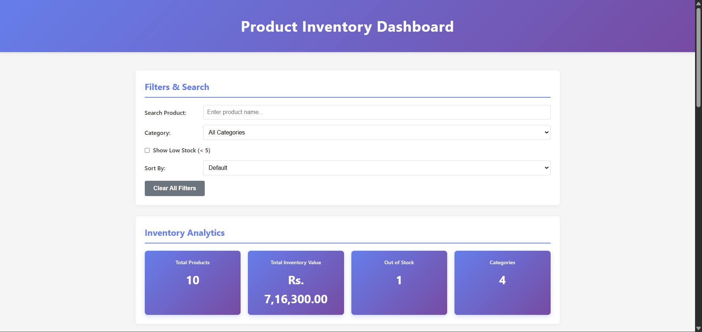
.png)
.png)

**What it shows:**
- Header with gradient background
- Filters and search active
- Analytics cards displaying metrics
- Product grid with all items
- Professional layout

**Features visible:**
- Header: ✓
- Controls: ✓
- Analytics: ✓
- Product cards: ✓
- Add product form: ✓

---

### **Screenshot 2: Search Functionality**
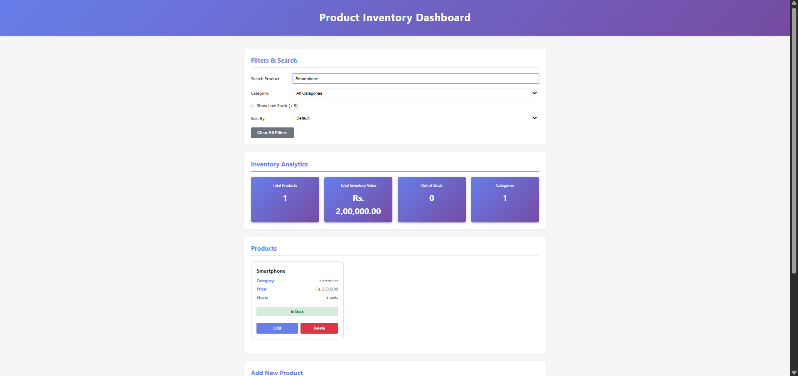

**What it shows:**
- Search field with "Smartphone" entered
- Only Smartphone product displayed
- Search is case-insensitive

**Demonstrates:**
- Real-time search ✓
- Case-insensitive filtering ✓
- Dynamic grid update ✓

---

### **Screenshot 3: Category Filter**
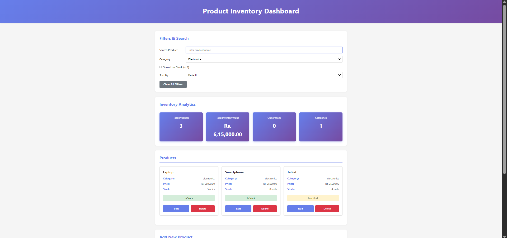

**What it shows:**
- Category dropdown with "Electronics" selected
- Only electronics products (Laptop, Smartphone, Tablet) displayed
- Other categories hidden
- Product count in analytics updated

**Demonstrates:**
- Category filter working ✓
- All categories available ✓
- Dynamic filtering ✓

---

### **Screenshot 4: Low Stock Filter**
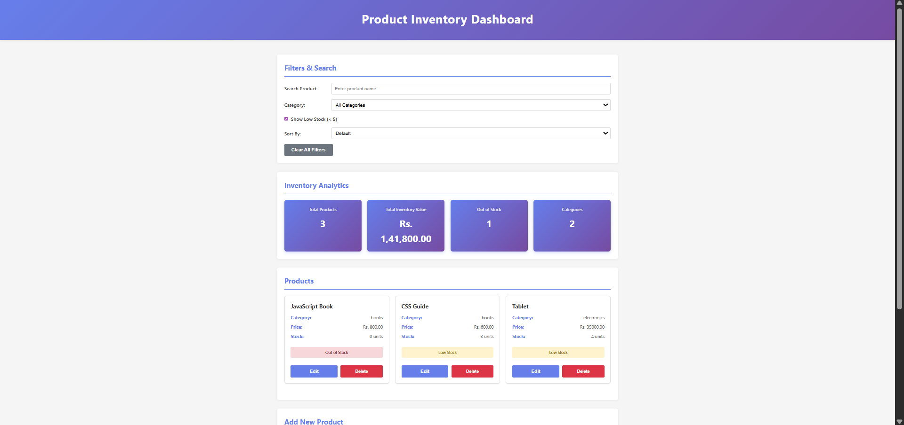

**What it shows:**
- "Show Low Stock (< 5)" checkbox checked
- Only products with stock < 5 displayed
- Yellow "Low Stock" badges visible
- Analytics updated to show filtered data

**Products shown:**
- JavaScript Book(0 units) - Out Of Stock
- CSS Guide (3 units) - Low
- Tablet (4 units) - Low

---

### **Screenshot 5: Sorting Functionality**
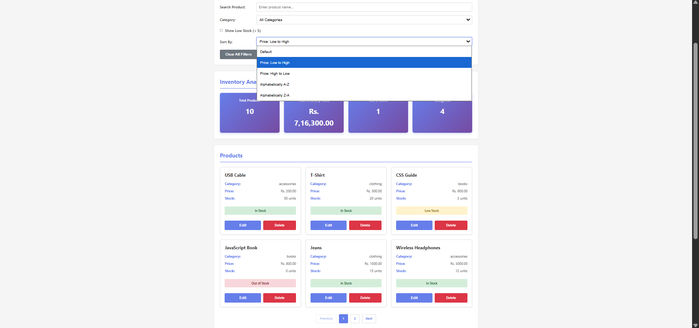

**What it shows:**
- "Price: Low to High" option selected
- Products arranged from cheapest to most expensive

**Sorting options visible:**
- Price Low to High ✓
- Price High to Low ✓
- Alphabetically A-Z ✓
- Alphabetically Z-A ✓

---

### **Screenshot 6: Add Product Form**
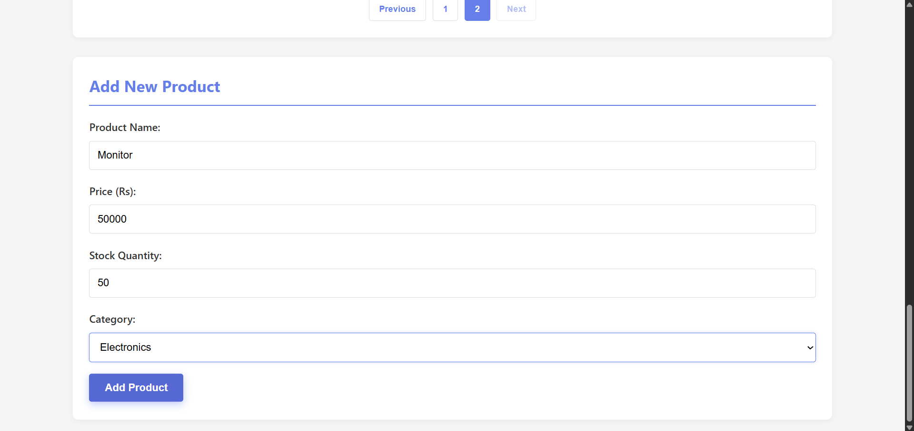

**What it shows:**
- Form with all fields visible
- Labels clear for each input
- Submit button "Add Product"
- Form at bottom of page

**Fields present:**
- Product Name (text)
- Price (number)
- Stock Quantity (number)
- Category (dropdown)

**Actions:**
- Fill form → Click Add
- Product appears in grid instantly
- Form clears automatically

---

### **Screenshot 7: Delete Confirmation**
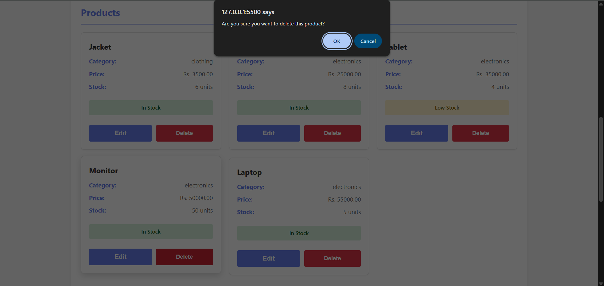

**What it shows:**
- Confirmation dialog when delete clicked
- User must confirm to proceed
- Cancel/OK buttons available
- Professional confirmation message

---

### **Screenshot 8: Analytics Dashboard**
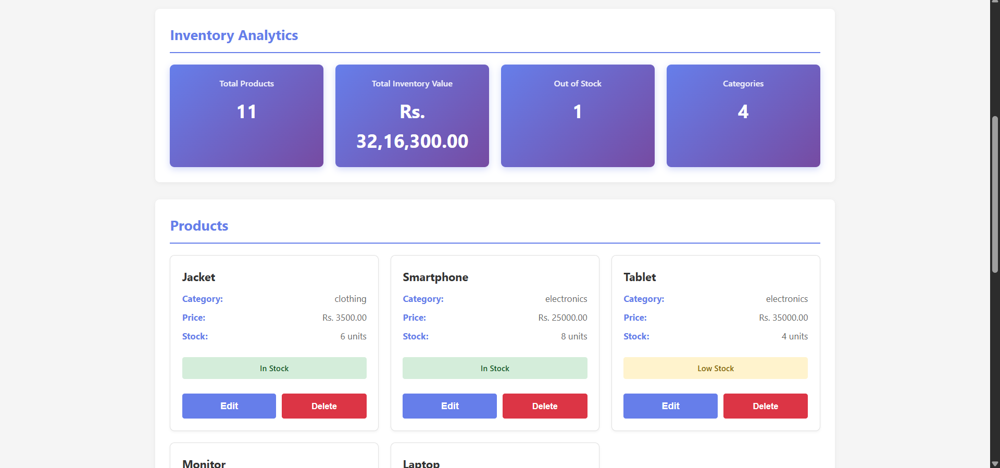

**What it shows:**
- Total Products: 
- Total Inventory Value: 
- Out of Stock: 
- Categories: 

**Calculations verified:**
- Total = count of all products ✓
- Value = sum of (price × stock) ✓
- Out of Stock = products where stock = 0 ✓
- Categories = unique category count ✓

---

### **Screenshot 9: Edit Product Feature**
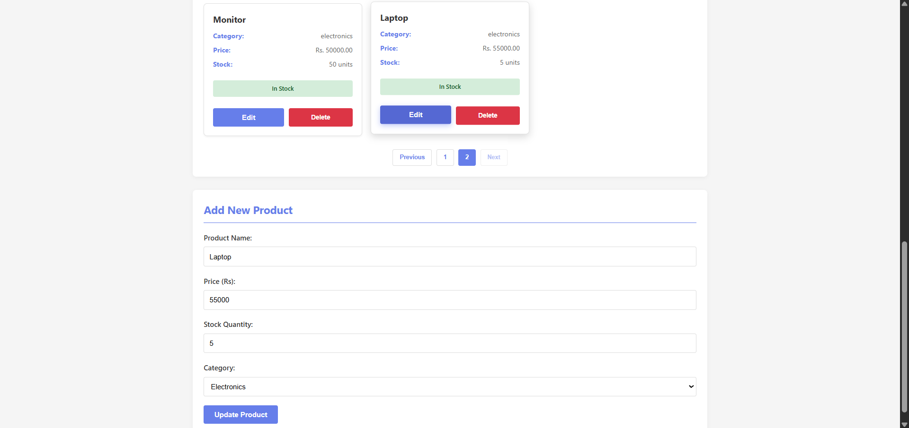

**What it shows:**
- Click "Edit" on product card
- Form populates with product data
- Button changes to "Update Product"
- Form scrolls into view

**After editing:**
- Change values in form
- Click "Update Product"
- Grid updates immediately
- localStorage updates

---

### **Screenshot 10: Responsive Mobile View**
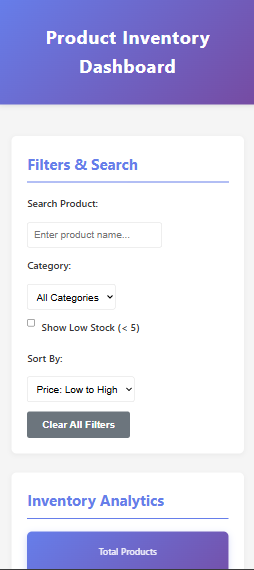

**What it shows:**
- Single column layout on mobile
- Full width inputs and buttons
- Readable text on small screen
- All features accessible
- Touch-friendly spacing

**Responsive breakpoints:**
- Mobile: < 480px ✓
- Tablet: 480-768px ✓
- Desktop: > 768px ✓

---

### **Screenshot 11: Loading State**
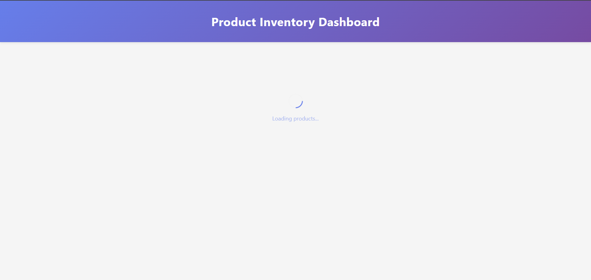

**What it shows:**
- Spinner animation (rotating circle)
- "Loading products..." text
- Main content hidden
- Shows for 1.5 seconds

---

### **Screenshot 12: No Products Found**
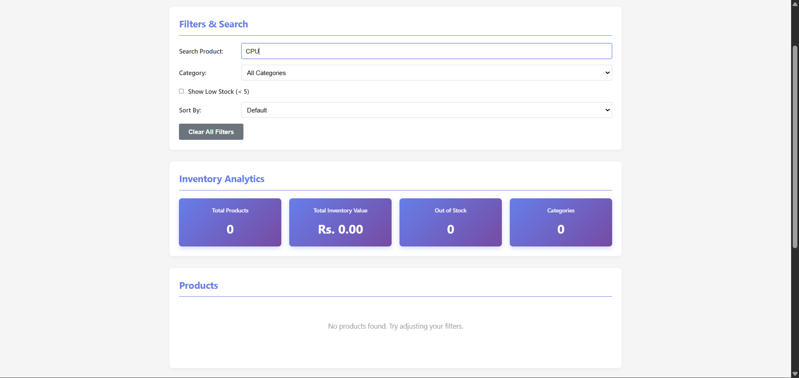

**What it shows:**
- Search returns no results
- "No products found. Try adjusting your filters." message
- Grid is empty
- Analytics show 0 products

---

### **Screenshot 13: Multiple Filters Combined**
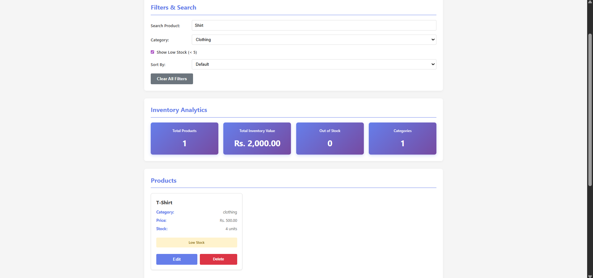

**What it shows:**
- Search: "Shirt"
- Category: "Clothing"
- Low Stock: Checked
- Result: T-Shirt (only matching all filters)

**Demonstrates:**
- All filters work together ✓
- No breaking functionality ✓
- Correct filtering logic ✓

---

### **Screenshot 14: Product with All Statuses**
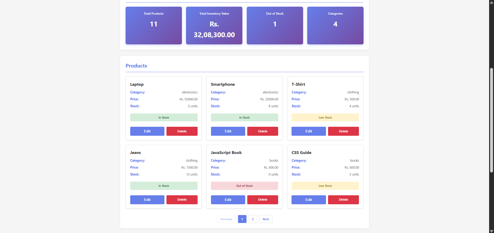

**What it shows:**
- Green badge: In Stock (stock ≥ 5)
- Yellow badge: Low Stock (0 < stock < 5)
- Red badge: Out of Stock (stock = 0)

---

## 🛠️ Technologies Used

### **Languages:**
- **HTML5** - Semantic structure, form elements
- **CSS3** - Responsive design, gradients, animations, flexbox, grid
- **JavaScript (ES6+)** - DOM manipulation, array methods, promises, async

---

## 📁 Project Structure

```
M_Raja_Rao_Reddy_frontend/mini_app/
├── index.html                 
├── style.css                  
├── script.js                 
├── README.md                 
└── screenshots/
    ├── 01_dashboard_overview.png
    ├── 01_dashboard_overview(2).png
    ├── 01_dashboard_overview(3).png
    ├── 02_search_functionality.png
    ├── 03_category_filter.png
    ├── 04_low_stock_filter.png
    ├── 05_sorting_by_price.png
    ├── 06_add_product_form.png
    ├── 07_delete_confirmation.png
    ├── 08_analytics_dashboard.png
    ├── 09_edit_product.png
    ├── 10_mobile_responsive.png
    ├── 11_loading_state.png
    ├── 12_no_products_found.png
    ├── 13_multiple_filters.png
    └── 14_stock_statuses.png
```

---

## 🚀 How to Run

### **Option 1: Open in Browser**
1. Double-click `index.html`
2. Opens in your default browser
3. See loading animation for 1.5 seconds
4. Dashboard displays with 10 default products

### **Option 2: Use Live Server (VS Code)**
1. Install "Live Server" extension
2. Right-click `index.html`
3. Select "Open with Live Server"
4. Refreshes automatically on code changes

---